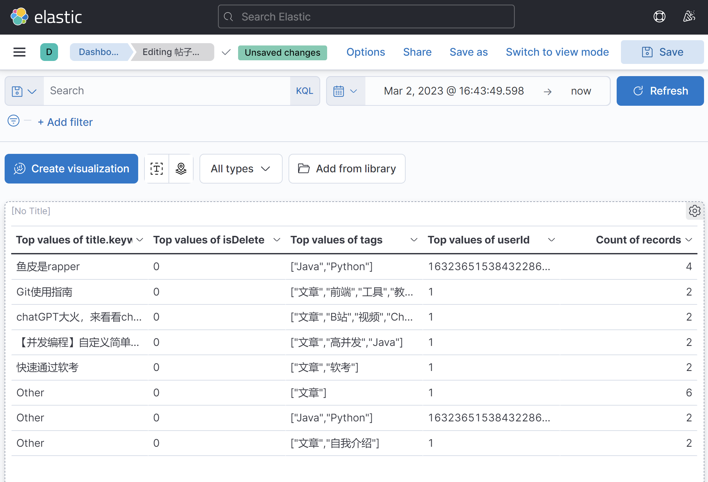

# 聚合搜索平台

## 项目简介

基于 Vue3 + Spring Boot + Elastic Stack 的一站式聚合搜索平台，也是简化版的企业级搜索中台。

* 对用户来说，使用该平台，可以在同一个页面集中搜索出**不同来源、不同类型的内容(比如文章、图片、用户、视频等)，提升用户的检索效率和搜索体验**；
* 对企业来说，当企业内部有多个项目的数据都存在搜索需求时，无需针对每个项目单独开发搜索功能，可以直接将各项目的数据源接入搜索中台，从而提升开发效率、降低系统雏护成本。

搜索页面示例:

搜文章:

搜图片:

搜用户:

Elastic Stack - Kibana 数据看板

项目架构图

## 项目特点

1. 本项目选用 Vue3 + Spring Boot 2.7新版本实现，包含完整的前后端，从需求分析、技术选型、系统设计、前后端开发再到最后上线，整个项目的制作过程。
2. 项目选题新颖，不是电商、管理系统、博客论坛等，而是**企业架构层面的通用搜索能力的抽象**，做完这个项目后，之后自己在做可业务系统时，都可以复用本项目的搜索能力。
3. 项目涉及多种数据爬虫方法、4种数据同步方法、接囗优化（运用了多种设计模式ElasticStack(Elasticsearch搜索引擎、Kibana看板）、压力测试等一系列知识。

## 技术选型

### 前端

* Vue3
* Ant Design Vue组件库
* 页面状态同步

### 后端

* Spring Boot2.7框架 + springboot-init 脚手架
* MySQL数据库(8.x版本）
* ElasticStack
    * **Elasticsearch搜索引擎**
    * Logstash数据管道
    * Kibana数据可视化
* 数据抓取(jsoup、HttpClient爬虫)
    * 离线
    * 实时
* 设计模式
    * 门面模式
    * 适配器模式
    * 注册器模式
* 数据同步（4种同步方式）
    * 定时 （通过定时任务方式）
    * 双写
    * Logstash
    * Canal （增量同步，基于日志解析）
    * 基于消息队列的发布/订阅的数据同步
         * hive是基于Hadoop的一个数据仓库工具，用来进行数据提取、转化、加载，这是一种可以存储、查询和分析存储在Hadoop中的大规模数据的机制。
* JMeter压力测试
    * 测试工具是一个性能不错的HTTP压力测试工具httpress

## 项目大纲(后续其他项目也可以参考)  重要

1. 项目介绍和计划
2. 需求分析
3. 技术选型、业务流程、系统架构介绍
4. 前端项目初始化
    * 前端脚手架使用
    * 框架、组件库、请求库整合
5. 后端项目初始化
    * SpringBoot万用模板介绍和使用
6. 前端聚合搜索页面开发
7. 前后端联调
8. 多数据源获取（包含几种爬虫方式的讲解和实践）
    * JSoup离线抓取,一次性任务，抓取后存入数据库
    * HttpCIient实时抓取
9. 聚合搜索业务场景分析
10. 聚合搜索接口开发
    * 门面模式(它提供了一个统一的接口，用来访问子系统中的一群接口，从而让子系统更容易使用。)  TODO 总结到cpp-notes
    * 性能测试
11. 搜索接口优化
    * 统一标准
    * 适配器模式   TODO 总结到cpp-notes
    * 注册器模式   TODO 总结到cpp-notes
12. 前端搜索接口调用优化
13. 从0开始学习EIasticStack  TODO 总结到cpp-notes
    * Elasticsearch概念及倒排索引原理
    * Elasticsearch/Kibana安装
    * Elasticsearch+Kibana DevTools入门实践
    * Elasticsearch调用方式讲解
14. ES搜索引擎实战
    * 几种Java客户端操作方式讲解
    * ES标准开发流程实战
    * 动静分离
15. 数据同步（4种同步方式） TODO 总结到cpp-notes
    * 定时
    * 双写
    * Logstash
    * Canal
16. Kibana搭建看板
17. JMeter接囗性能测试
18. 项目扩展点

## 项目主要工作

### 前端

1. 基于Vue3 + Ant Design Vue实现响应式页面开发，使用 Tab组件 + Vue Router 动态路由实现统一页面布局。
2. 通过用户点击Tab框时更改路由来切换各类数据（文章、图片、用户）的搜索结果，并选用不同的组件进行展示。
3. 为解决刷新页面后搜索结果丢失的问题，定义searchParams响应式变量来集中保存当前的搜索条件（比如关键词、搜索类别、分页），并通过VueRouter的query参数将搜索条件同步到url的querystring中。

### 后端

1. 基于自己二次开发的Spring Boot初始化模板+MyBatisX 插件，快速生成基本数据源的增删改查（比如用户、文章、图片）。
2. 数据源获取：
    * 使用HttpClient请求**离线**获取外部网站的文章并使用Hutool的JSONUtil解析和预处理文章，最终添加到本地数据库
    * 使用jsoup**实时**请求bing搜索接囗获取图片，并使用CSS Selector语法解析和预处理图片信息，最终返回给前端。
3. 为实现多类数据源的整体搜索采用**门面模式**在后端对各类数据源的搜索结果进行聚合，统一返回给前端。
    * **减少了前端请求次数(N次到1次）以及前端开发复杂度**。
    * 通过Completable Future **并发搜索**各数据源，进一步提升搜索接囗性能，实测整体响应时长由300ms减少为10ms。
4. 为提高聚合搜索接囗的通用性，首先通过定义数据源接囗来实现**统一的数据源接入标准**（比如，新数据源必须支分页）
    * 当新数据源（比如视频）要接入时，只需使用**适配器模式**对其数据查询接囗进行封装、以适配数据源接囗，无须修改原有代码，**提高了系统的可扩展性**。
5. 为减少代码的圈复杂度，使用**注册器模式**代替if else来管理多个数据源对象，**调用方可根据名称轻松获取对象**。（圈复杂度工具实测）。
6. 为解决文章搜索不出来的问题，自主搭建Elasticsearch来代替MySQL的模糊查洵，并通过为索引绑定**ik分词器**实现了更灵活的分词搜索且使用JMeter测试后发现搜索性能提升××％（qps到xxqps)。
7. 构建ES文章索引时，采用**动静分离**的策略，只在ES中存储要检索的、修改不频繁字段（比如文章）用于检索，而修改频繁的字段（比如点赞数）从数据库中关联查出(先通过ES找到id，再通过id到数据库里查找记录)，从而减少了**ES数据更新和同步的成本、保证数据一致性**。
8. 为了更方便地管理Elasticsearch中的数据自主搭建Kibana并配置index pattern和看板，实现对文章数据的可视化管理。
9. 开发搜索功能时，使用Kibana DevTools + DSL调试ES的搜索效果开使用 Spring Data Elasticsearch的Query Builder组合查询条件，实现对ES内文章的灵活查洵（比如查询同时查询标题和文章中带有指定关键字的内容）。
10. 以下2选1：
    * 使用Spring Scheduler定时（1分钟）同步近5分钟内发生更新的MySQL的文章数据到ES（1分钟同步近5分钟的数据，采用冗余的特性加强数据的一致性），通过唯一id来保证每条数据同步的准确性。
    * 自主搭建Logstash实现每分钟同步MySQL的文章数据到ES，并通过指定tracking_column为更新时间字段解决重新更新的问题。
11. 使用Knife4j + Swagger 自动生成后端接囗文档，并通过编写ApiOperation等注解补充接囗注释避免了人工编写维护文档的麻烦。

## 扩展思路

### 前端

1. 为解决用户频繁输入带来的搜索请求性能浪费，使用Lodash库实现搜索功能的**防抖**。
2. 可以尝试使用umi的one-api插件，**根据后端的swagger接囗文档自动生成请求代码**。
3. 对于各类数据的查询请求，可以使用**懒加载或骨架屏**来优化用户体验。
4. 可以尝试实现文章和图片的无限滚动列表，并解决数据量过大芾来的性能问题。
5. 可以在前端使用Vuex或Pinia等状态管理工具实现搜索记录功能。

### 后端

1. 可以使用Canal监听MySQL, 并将数据实时同步到Elasticsearch（一定要能突出实时同步的必要性，比如要搜索的数据频繁改动）
2. 可以使用Redis对查询数据进行缓存，并测试下缓存命中率和性能提升的效果
3. 可以记录并统计用户的搜索词，从而实现热搜、词云图、看板分析等功能。
4. 为 Elasticsearch 的 ik 插件自定义词典，实现系统内一些关键词的灵活分词查洵。（词典如何生成也是需要考虑的问题，可以从热搜词下手）
5. 使用 Elasticsearch 的 highlight 语法实现搜索词高亮。
6. 使用 Elasticsearch 的 suggest 语法实现搜索建议。
7. 聚合搜索接囗中，可以使用自定义线程池来实现并发，线程池的参数配置为IO密集型，即线程数多一些。
8. 可以使用Guava Retrying 重试库来保证调第三方接囗的稳定性，可以实测一下接囗可用性有几个9。
9. 可以使用定时任务定期去做离线文章爬虫。