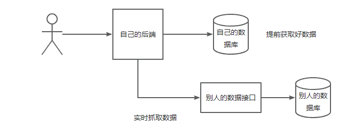

# 聚合搜索平台具体实现

# 前端

## 前端初始化

1. 参考Ant Design 组件库的官方文档来搭建初始化项目(https://2x.antdv.com/docs/vue/getting-started-cn)，并整合组件库。
2，删减不需要的页面和路由

## 前端开发

组件库使用方式：从上到下依次在组件库文档中找到对应组件，复制粘贴+修改，完成基本页面开发。

## 记录搜索状态

目标：**用url记录页面搜索状态**，当用户刷新页面时，能够从url还原之前的搜索状态。

需要双向同步：url<=>页面状态

核心小技巧：**把同步状态改成单向**，即只允许url来改变页面状态，不允许反向。

分步来实现，思路更清晰：

1. 让用户在操作的时候，改变url地址（点击搜索框，搜索内容填充到url上？切换tab时，也要填充）
2. 当url改变的时候，去改变页面状态（监听url的改变, WatchEffect）

## 前后端联调

使用Axios向后端发送请求，步骤参考（https://www.axios-http.cn/docs/intro）。

1. 前端整合Axios
2. 自定义Axios实例
3. 发送请求

# 后端

## 后端初始化

1. 使用星球springboot-init万用项目模板
2. 直接使用swagger文档在线测试接囗

## 获取不同类型的数据来源

### 数据抓取流程

1. 分析数据源，怎么获取？
2. 拿到数据后，怎么处理？
3. 写入数据库等存储

### 数据抓取的几种方式

1. 直接请求数据接囗（最方便），可便用HttpClient、OKHttp、RestTemplate、Hutool(https://hutool.cn/)等客户端片清求
2. 等网页渲染出明文内容后，从前端完整页面中解析出需要的内容
3. 有一些网站可能是动态请求的，他不会一次性加载所有的数据而是要你点某个按钮、输入某个验证码才会显示出数据。可便用无头浏览器：selenium、robotframework

#### 获取文章

内部没有，可以从互联网上获取基础数据=>爬虫

可便用该网站进行测试抓取：https://www.code-nav.cn/learn/passage，获取到文章后要入库。

**离线抓取：定时获取或者只获取一次**

#### 用户获取

每个网站的用户基本都是自己的，不需要从外界获取。

#### 图片获取

实时抓取：我们自己的数据库不存这些数据，用户要搜的时候，直接从别人的接囗（网站/数据库）去搜。

流程如图：



jsoup解析库：支持发送请求获取到HTML文档，然后从中解析出需要的字段。

## 业务场景分析

目前是在页面加载时，调用三个接囗分别获取文章、图片、用户数据。

几种不同的业务场景：

1. 用户点某个tab时，只调用这个tab的接囗，比如：https://www.code-nav.cn/search/passage?current=2&pageSize=8&searchText=111&sortField=_score&sortOrder=descend
2. 针对聚合内容的网页，可以一个请求搞定，比如：https://tophub.today/
3. 有可能还要查询其他的信息，比如其他数据的总数，同时给用户反馈，比如B站搜索页

需要根据实际情况去选择方式！

目前设计存在的问题：

1. 请求数量比较多，可能会收到浏览器的限制
2. 请求不同接囗的参数可能不一致，增加前后端沟通成本
3. 前端写调用多个接囗的代码，重复代码

从而引入**聚合搜索**

## 聚合接口

1. 请求数量比较多，可能会收到浏览器的限制 => 用一个接囗请求完所有的数据（后端可以开发，几乎没有并发数量限制）

```java
user=userService.query
post=postService．query
picture=pictureService.query
return user + post + picture
```

2. 请求不同接囗的参数可能不一致，增加前后端沟通成本 => 用一个接囗把请求参数统一，前端每次传固定的参数，后端去对参数进行转换

```
前端统一传searchText
后端把searchText转换为 userName => queryUser
```

统一返回结果：比如都便用Page页面封装

3. 前端写调用多个接囗的代码，重复代码 => 用一个接囗，通过不同的参数去区分查询的数据源

```
前端传type调用后端同一个接口，后端根据type调用不同的service查询
比如：type=user , userService.query
```

## 聚合接口优化

思考：怎么样能让前端又能一次搜出所有数据、又能够分别获取某一类数据

解决方案:

```
前端传type调用后端同一个接口，后端根据type调用不同的service查询
比如：type=user , userService.query
```

逻辑；
1. 如果type为空，那么搜索出所有的数据
2. 如果type不为空
    * 如果type合法，那么查出对应数据
    * 否则报措

问题：type增多后，要把查询逻辑堆积在controller代码里么？

思考：怎么能让搜索系统更轻松地接入更多的数据源？

### 门面模式(外观模式)

介绍：帮助用户（客户端）去更轻松地实现功能，不需要关心门面背后的细节。（它提供了一个统一的接口，用来访问子系统中的一群接口，从而让子系统更容易使用。）

聚合搜索类业务基本都是门面模式：**即前端不用关心后端从哪里、怎么去取不同来源、怎么去緊合不同来源的数据**，更方便地获取到内容。

当调用系统（接囗）的客户端觉得麻烦的时候，你就应该思考，是不是可以抽象一个门面了。

### 适配器模式

1. 定制统一的数据源接入规范（标准）：
    * 什么数据源允许接入？
    * 数据源接入时要满足什么要求？
    * 需要接入方注意什么事情？

本系统要求：任何接入我们系统的数据，它必须要能够**根据关键词搜索、并且支分页搜索**。

通过声明接囗的方式来定义规范。

假如说我们的数据源已经支了搜索，但是原有的方法参数和我们的规范不一致，怎么办？

使用适配器模式：通过转换，让两个系统能够完成对接。


### 注册器模式（本质也是单例）

提前通过一个map或者其他类型存储好后面需要调用的对象。
效果：替代了if...else...,代码量大幅度减少，可维护可扩展。


## 搜索优化

现有问题：搜索不够灵活。

比如，搜"鱼皮rapper"无法搜到“鱼皮是rapper"，因为MySQL数据库的like是包含查询。

需要支持分词搜索

## 数据同步

一般情况下，如果做查询搜索功能，使用ES来模糊搜索，但是数据是存放在数据库MySQL里的，所以说我们需要把MySQL中的数据和ES进行同步，保证数据一致（**以MySQL为主**）。

MySQL= > ES（单向）

首次安装完ES, 把MySQL数据全量同步到ES里，写一个单次脚本

4种方式，全量同步〈首次）+ 增量同步（新数据）：

1. 定时任务，比如1分钟1次，找到MySQL中过去几分钟内（至少是定时周期的2倍）发生改变的数据，然后更新到ES。
    * 优点：简单易懂、占用资源少、不用引入第三方中间件
    * 缺点：有时间差
    * 应用场景：数据短时间内不同步影响不大、或者数据几乎不发生修改
2. 双写：写数据的时候，必须也去写ES; 更新删除数据库同理。〈事务，建议先保证MySQL写成功，如果ES写失败了，可以通过定时任务 + 日志 + 告警进行检测和修复（补偿））
3. 用 Logstash 数据同步管道（一般要配合kafka消息队列 + beats采集器）
4. Canal 监听 MySQL Binlog,实时同步

## 压力测试

官方文档：https://jmeter.apache.org/

找到jar包：apache-jmeter-5.5\apache-jmeter-5.5\bin\ApacheJMeter.jar启动

配置线程组=>请求头=>默认请求=>单个请求=>响应断言=>聚合报告/结果树

99％分位：99％的用户都在这个响应时间内

吞吐量：每秒处理的**请求数qps**
